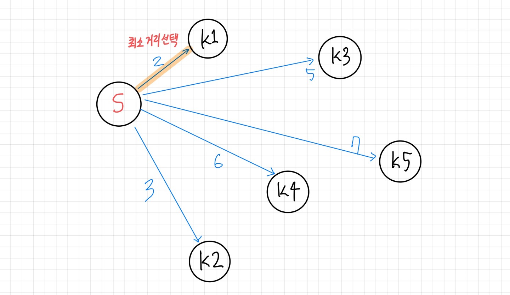
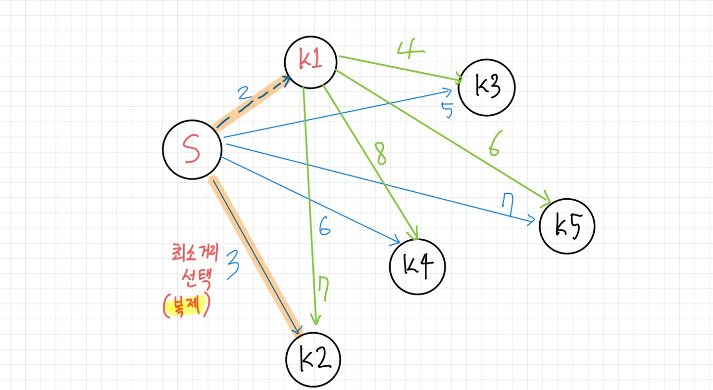
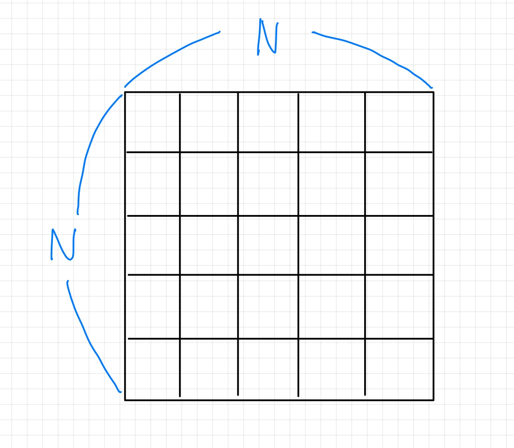

# 복제로봇(백준 / G2 / MST)

## 1. 문제 인식

---

### 알고리즘 선택

- 시작점에서 모든 열쇠로의 간선 중 최소 거리인 지점으로 이동
    
    
    
- 이동한 지점(K1)으로부터 다른 열쇠와의 간선 + 시작 지점에서 다른 열쇠와의 간선 중
    
    최소 거리인 길로 이동(시작점과 연결된 간선이 또 최소 거리이면 시작점에서 로봇을 복제)
    
    
    

💡 모든 정점이 최소 비용 간선들로 연결되기만 하면 된다 ⇒ MST문제

**🤔 만약, 로봇들이 복제가 되지 않는다면?**

모든 정점에서 선택할 수 있는 간선은 최소 거리 간선 1개 ⇒ **다익스트라 문제가 됨!**

### 문제 해결 Flow

1. 시작점, 열쇠들 사이의 **간선리스트 생성**
    1. 가중치는 정점 사이의 거리
    2. 정점 간 거리는 **BFS**로 구함
2. 간선리스트를 이용하여 **서로소 집합 연산을 통한 MST**

## 2. 공간 복잡도 확인

---

### 1. 입력 데이터(미로) 저장

  

- **가로, 세로 길이 최댓값:** 50
- **자료구조:** 2차원 배열(char)

👉 **용량** : **50 * 50 * 2B = 500B**

### 2. 간선 리스트

- **열쇠개수 MAX:** 250개 ⇒ 최대 정점 개수
- **간선의 개수:**  $\sum N (N은 1 ~ 249) ⇒ $(249 * 250)/2 =30000
- **간선 당 메모리(객체):** 정수3개 + a ⇒ **50B**

👉 **용량** : $30000 * 50B = 1.5MB$

### 3. BFS Queue

- **원소의 최대 개수: $50\sqrt{2}$**
- **원소의 크기: 8Byte**

👉 **용량** : $50\sqrt{2} * 8 = 400\sqrt{2}B$

✅ 메모리 제한 128MB에 한참 못 미치므로, 메모리 걱정은 하지 않아도 됨.

## 3. 의사 코드(Pseudo Code)

---

- 미로 입력 받으면서 시작점과 열쇠 위치를 저장(정점 번호 부여, 시작점: 0번)
- 각 정점 사이의 거리값으로 간선리스트 생성
    - 각 정점 사이의 거리는 BFS를 이용하여 구함
    - 0번부터(시작점) M번 정점까지를 시작점으로 설정
    - 각 시작점에서 4방탐색 BFS를 수행
    - 열쇠를 발견하면 다음의 정보를 간선리스트에 추가
        - 시작 정점번호(from)
        - 발견한 열쇠의 정점번호(to)
        - 두 정점 사이 거리(weight)
- 간선 리스트로 MST생성
- 모든 정점이 연결되었다면 가중치 합 출력(연결이 되지 않았다면 -1출력)

## 4. 구현

---

### 1. 정점 정보 저장 방법

정점의 정보는 **BFS에서 거리를 구할 때 활용**된다.

(1) 0번~M-1번 정점을 시작점으로, BFS를 통해 다른 정점까지의 거리를 탐색

(2) 정점 발견 시, 시작 정점 번호, 발견 정점 번호, 거리 를 Edge객체에 저장한다.

(1)에서는 **정점번호로 정점의 위치값**을, (2)에서는 **정점위치로 정점번호**를 찾아야 한다.

따라서, 정점위치 정보를 정수로 표현한 후 2개의 1차원 배열을 만들 것이다.

- 정점번호를 index, 정점위치를 값으로 가지는 1차원 배열
- 정점위치값을 index로, 정점번호를 값으로 가지는 1차원배열

✅ 위치정보를 (i, j)라고 할 때, i와 j의 최대값은 각각 50이다. 따라서, i값에 100을 곱하고, j값을 더해주면 가로와 세로 위치 값을 보존하면서 하나의 정수값으로 표현 가능하다. 이때 위치정보의 최대값은 5050이 된다.

정점번호 or 정점위치값을 인덱스로 가지기 때문에 원하는 값을 더 빠르게 구할 수 있게 된다.

### 2. 미로 저장

위의 아이디어로 위치(i, j)를 하나의 정수로 표현 가능하다. 가로, 세로의 길이 범위가 작을 때 활용하기 좋은 방법이다. 이 방법으로 위치값을 2개의 정수에서 1개의 정수로 표현할 수 있기 때문에 미로를 2차원 배열이 아닌 1차원 배열로 만들 수 있다. 그 1차원 배열의 할당 크기는 (100 * N) + N이 된다.

미로의 상하좌우 이동은 위치값에 -100(상), +100(하), -1(좌), +1(우) 연산을 해주면 된다.

⚠️ 이 방식으로 미로를 저장하면, 상하좌우 이동 시 맵을 벗어나는 경우를 위치값으로 체크하는 것이 매우 어렵다. (ex. 500 -1 = 499)이 문제처럼 테두리가 있어서 테두리값으로 맵을 벗어난 것을 체크할 수 있을 때 사용하기를 권장한다.

## 고찰

대략적인 공간복잡도 계산을 통해 메모리가 넉넉함을 확인하게 되었다. 이를 통해 시간 복잡도 최적화를 위해 공간을 자신있게 활용할 수 있었다.